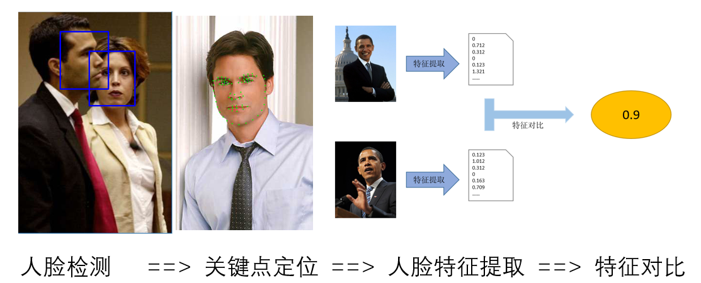
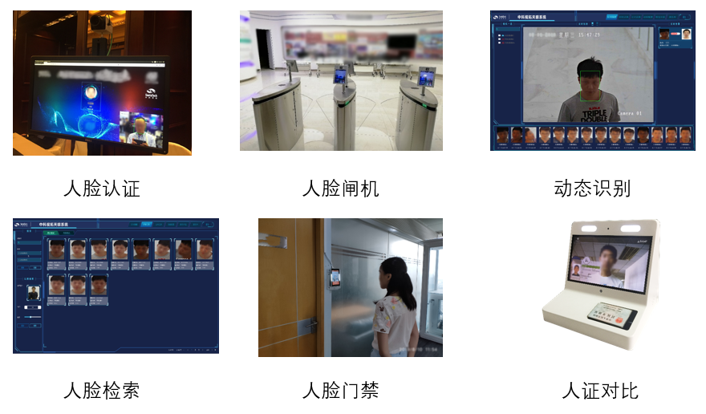

# **华中科技大学计算机科学与技术学院**
# **机器学习课程结课项目-人脸识别系统**

[](LICENSE)

[中文](./README.md) [English](./README_en.md)

## 1. 中科视拓开源框架介绍
本项目使用基于C++的人脸识别引擎SeetFace2进行人脸检测和特征提取  
`SeetaFace2` 人脸识别引擎包括了搭建一套全自动人脸识别系统所需的三个核心模块，即：人脸检测模块 `FaceDetector`、面部关键点定位模块 `FaceLandmarker` 以及人脸特征提取与比对模块 `FaceRecognizer`。
已经两个辅助模块 `FaceTracker` 和 `QualityAssessor` 用于人脸跟踪和质量评估。

<div align=center>

</div>

`SeetaFace2` 采用标准 C++ 开发，全部模块均不依赖任何第三方库，支持 x86 架构（Windows、Linux）和 ARM 架构（Android）。SeetaFace2 支持的上层应用包括但不限于人脸门禁、无感考勤、人脸比对等。

<div align=center>

</div>


SeetaFace2 是面向于人脸识别商业落地的里程碑版本，其中人脸检测模块在 FDDB 上的 100 个误检条件下可达到超过 92% 的召回率，面部关键点定位支持 5 点和 81 点定位，1 比 N 模块支持数千人规模底库的人脸识别应用。


模块 | 方法概述 | 基础技术指标 | 典型平台速度
-----|---------|-------------|------------
**人脸检测** | Cascaded CNN | FDDB 上召回率达到92%（100个误检情况下）。 | 40 最小人脸<br>I7: 70FPS(1920x1080)<br>RK3399: 25FPS(640x480)
**面部关建点定位(81点和5点)** | FEC-CNN | 平均定位误差（根据两眼中心距离归一化）<br>300-W Challenge Set 上达到 0.069。 | I7: 450FPS 和 500FPS<br>RK3399: 110FPS 和 220FPS
**人脸特征提取与比对** | ResNet50 | 识别：通用1：N+1场景下，错误接受率1%时，<br>1000人底库，首选识别率超过98%，<br>5000人底库，首选识别率超过95%。 | I7: 8FPS<br>RK3399: 2.5FPS

与 2016 年开源的 `SeetaFace 1.0` 相比，`SeetaFace2` 在速度和精度两个层面上均有数量级的提升。

<table>
    <tr>
        <th rowspan="2">版本</th>
        <th colspan="2">人脸检测</th>
        <th colspan="2">关键点定位</th>
        <th colspan="2">人脸识别</th>
        <th rowspan="2">第三方依赖</th>
    </tr>
    <tr>
        <td>速度[1]</td>
        <td>单精度[2]</td>
        <td>速度</td>
        <td>功能</td>
        <td>训练数据规模</td>
        <td>应用</td>
    </tr>
    <tr>
        <th>1.0</th>
        <td>16FPS</td>
        <td>85%</td>
        <td>200FPS</td>
        <td>5点</td>
        <td>140万张</td>
        <td>实验室</td>
        <td>无</td>
    </tr>
    <tr>
        <th>2.0</th>
        <td>77FPS</td>
        <td>92%</td>
        <td>500FPS</td>
        <td>5/81点</td>
        <td>3300万张</td>
        <td>商业环境</td>
        <td>无</td>
    </tr>
    <tr>
        <th>备注</th>
        <td colspan="7">
            [1] 640x480输入、检测40x40人脸、I7-6700。<br>
            [2] 人脸检测的精度指100个误捡FDDB数据集的召回率。
        </td>
    </tr>
</table>

知人识面辩万物，开源赋能共发展。`SeetaFace2` 致力于 AI 赋能发展，和行业伙伴一起共同推进人脸识别技术的落地。


## 2. 编译(该项目只能在Linux平台上编译）
在编译之前，将该项目文件夹名称(ML-FinalProject)改为(SeetaFace2)
### 2.1 编译依赖
+ 编译工具
  + For linux
    - GNU Make 工具
    - GCC 或者 Clang 编译器
+ 依赖库
  - [可选] [OpneCV](http://opencv.org/) 仅编译例子时需要
+ 依赖架构
  - CPU 支持 SSE2 和 FMA [可选]（x86）或 NENO（ARM）支持

### 2.2 编译参数
  - BUILD_DETECOTOR: 是否编译人脸检测模块。ON：打开；OFF：关闭
  - BUILD_LANDMARKER: 是否编译面部关键点定位模块。ON：打开；OFF：关闭
  - BUILD_RECOGNIZER: 是否编译人脸特征提取与比对模块。ON：打开；OFF：关闭
  - BUILD_EXAMPLE: 是否编译例子。ON：打开；OFF：关闭，打开需要预先安装 `OpneCV`
  - CMAKE_INSTALL_PREFIX: 安装前缀
  - SEETA_USE_FMA: 是否启用 `FMA` 指令。默认关闭。只有目标是`x86`架构是起作用
  - SEETA_USE_SSE2: 是否启用 SSE2 指令。window 和 unix 默认为 ON，其它默认为 OFF。

### 2.3 各平台编译
#### 2.3.1 linux 平台编译说明
  - 依赖
    + opencv。仅编译例子时需要

        sudo apt-get install libopencv-dev 

  - 编译

        cd SeetaFace2
        mkdir build
        cd build
        cmake .. -G"Unix Makefiles" -DCMAKE_INSTALL_PREFIX=`pwd`/install -DCMAKE_BUILD_TYPE=Release -DBUILD_EXAMPLE=OFF # 如果有 OpneCV，则设置为 ON
        cmake --build . --config Release 

  - 安装

        cmake --build . --config Release --target install/strip

  - 运行例子
    + 把生成库的目录加入到变量 LD_LIBRARY_PATH 中

            export LD_LIBRARY_PATH=$LD_LIBRARY_PATH:`pwd`/bin

    + 拷贝模型文件到程序执行目录的 model 目录下

            cd SeetaFace2
            cd build
            cd bin
            mkdir model
            cp fd_2_00.dat pd_2_00_pts5.dat pd_2_00_pts81.dat .

    + 执行 bin 目录下的程序
      - points81

            cd SeetaFace2
            cd build
            cd bin
            ./points81

      - search

            cd SeetaFace2
            cd build
            cd bin
            ./search

    对于以上编译的步骤，我写了一个shell脚本，简化编译的过程，脚本是在bin目录下的compile.sh  
    所以对于本项目的编译，你只需要cd到bin目录，运行compile.sh脚本就行了
```shell
	sudo chmod +x compile.sh
	./compile.sh
```
    然后就可以运行bin目录下的可执行文件了，当然，你还需要准备好opencv的环境
    另外很重要一点就是在源代码中训练集图片和测试集图片，还有人脸识别底层库的路径我都设置成了绝对路径，这就需要你们将源代码中的路径进行修改为你们自己想要设置的路径，重新编译，然后图片才能成功读取进内存。还有下载下来的模型文件如上面所说的要放在model目录下  
    不会有人连改下源代码中的图片库路径都做不到吧，不会吧不会吧  
    芜湖～起飞  


## 3. 目录结构


    |-- SeetaFace2<br>
        |-- documents（SDK 接口说明文档）  
        |-- example（C++版本SDK实例代码）
           |--  crop_face		(对图片进行人脸截取）
           |-- FaceRecognition（机器学习结课项目源代码，C++）
           |-- points81		（81点人脸检测）
           |-- propse	（不知道）
           |-- search	（完整的人脸识别系统）
           |-- SeetaExample	（不知道）
           |-- test	（我写的测试代码文件）
           |-- tracking	（不知道）
           |-- CMakeList.txt	（example目录下的编译列表）
        |-- FaceDetector（人脸检测模块）  
        |-- FaceLandmarker（特征点定位模块）  
        |-- FaceRecognizer（人脸特征提取和比对模块）  
        |-- SeetaNet（前向计算框架模块）  

## 4. 模型下载
- 人脸检测模块 FaceDetector 模型下载链接：  
MD5     ：E88669E5F1301CA56162DE8AEF1FD5D5  
百度网盘：https://pan.baidu.com/s/1Dt0M6LXeSe4a0Pjyz5ifkg 提取码：fs8r  
Dropbox : https://www.dropbox.com/s/cemt9fl48t5igfh/fd_2_00.dat?dl=0

-  面部特征5点定位模块 FaceLandmarker 模型下载链接：  
MD5     ：877A44AA6F07CB3064AD2828F50F261A  
百度网盘：https://pan.baidu.com/s/1MqofXbmTv8MIxnZTDt3h5A 提取码：7861  
Dropbox : https://www.dropbox.com/s/noy8tien1gmw165/pd_2_00_pts5.dat?dl=0

-  面部特征81点定位模块 FaceLandmarker 模型下载链接：  
MD5     ：F3F812F01121B5A80384AF3C35211BDD  
百度网盘：https://pan.baidu.com/s/1CCfTGaSg_JSY3cN-R1Myaw 提取码：p8mc  
Dropbox : https://www.dropbox.com/s/v41lmclaxpwow1d/pd_2_00_pts81.dat?dl=0

- 人脸特征提取和比对模块 FaceRecognizer 模型下载链接：  
MD5     ：2D637AAD8B1B7AE62154A877EC291C99  
百度网盘：https://pan.baidu.com/s/1y2vh_BHtYftR24V4xwAVWg 提取码：pim2  
Dropbox : https://www.dropbox.com/s/6aslqcokpljha5j/fr_2_10.dat?dl=0

## 5. FaceRecognition
FaceRecognition是我这学期机器学习课程的结课项目，因为疫情，原本的考试改为了大作业形式，对我来说求之不得，毕竟做课设比复习考试有意思多了。
